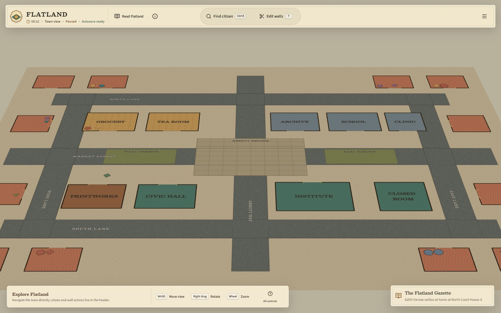
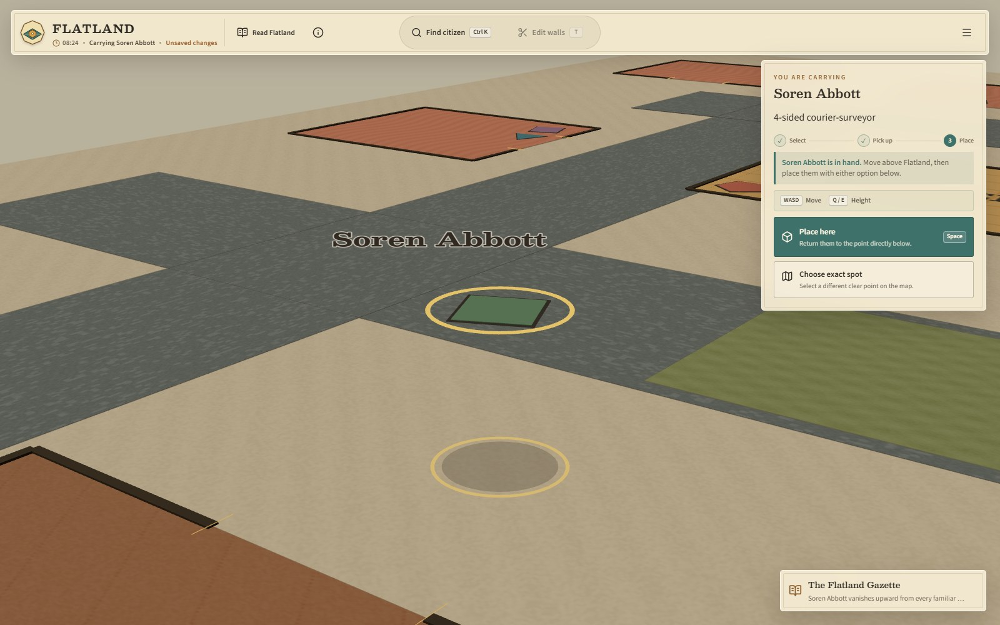
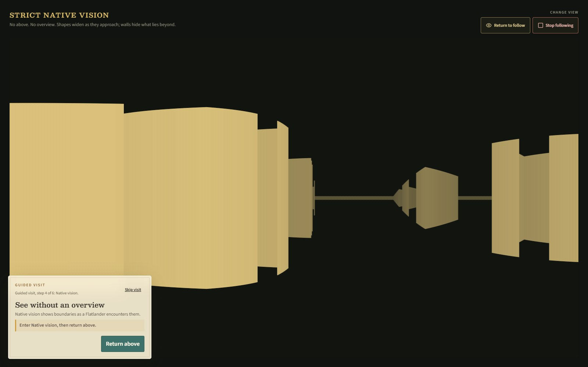
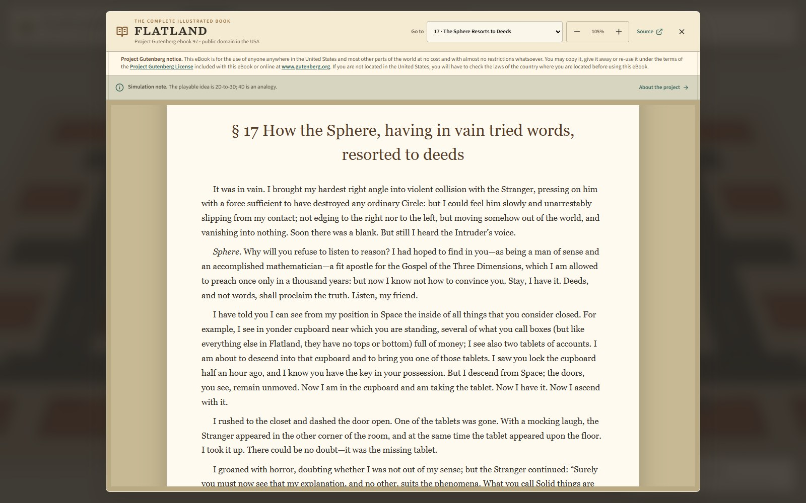
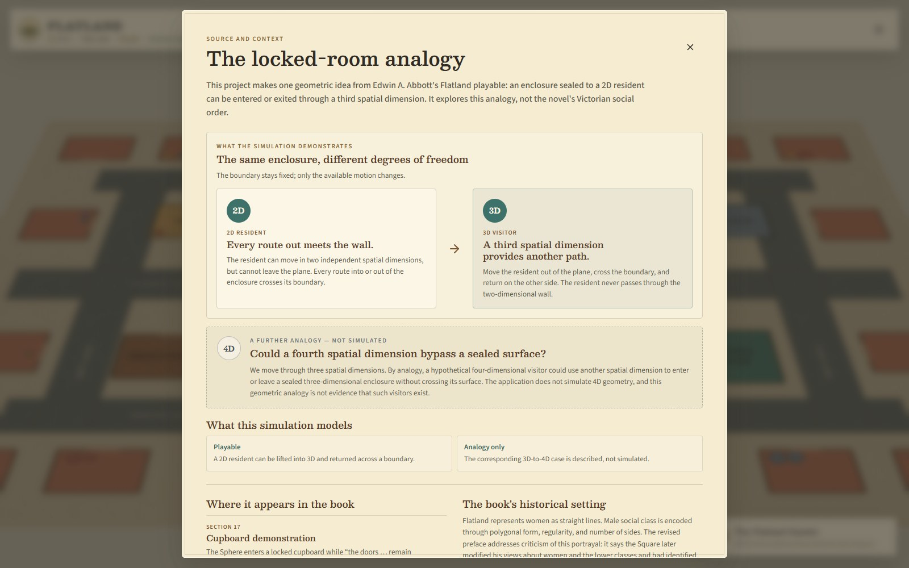

# Flatland: Above the Plane

**A living two-dimensional town. An impossible third direction. An 1884 thought experiment you can play.**

## [Explore Flatland in your browser →](https://flatland.codefactory.synology.me/)

**Live website: [flatland.codefactory.synology.me](https://flatland.codefactory.synology.me/)** · No sign-up · Browser-local saves · Complete illustrated book included

[The experience](#the-experience) · [Mathematical roots](#the-mathematical-roots) · [History and society](#the-book-and-its-society) · [Run locally](#run-locally) · [Contribute](#contributing-and-security)

[](https://flatland.codefactory.synology.me/)

*Town view in the running application. [Open the live town](https://flatland.codefactory.synology.me/) or explore the screenshots below.*

Flatland: Above the Plane is an independent, interactive adaptation of Edwin A. Abbott's *Flatland: A Romance of Many Dimensions*. Follow the citizens of a geometric town, see the world from inside their plane, and discover why a sealed room is only sealed to someone without another direction to move in.

It is a small exploratory sandbox, not a competitive game or a full reconstruction of Victorian society. You do not need to know the book—or any advanced mathematics—to begin.

## The experience

### Start with a three-minute visit

1. **[Open the live demo](https://flatland.codefactory.synology.me/)** and choose **Take the 90-second tour**. It introduces the town, a resident's routine, Native vision, wall editing, and undo.
2. **Try the extra direction.** Select a citizen, choose **Pick up**, then **Choose exact spot** to return them to a clear point on the other side of a boundary. The **Controls & shortcuts** help explains the Closed Room experiment: leave its wall intact and bypass it through height.
3. **Connect the experiment to the book.** Open **Source and context** from the information button, then jump directly to sections 17 and 19—or use **Read Flatland** to start at the beginning.

Every visit can be different: watch the town run, intervene in its routes, create a citizen, or simply read.

### Two viewpoints, one world

| Lift beyond the plane | See from within it |
| --- | --- |
| [](docs/images/dimensional-lift.jpg) | [](docs/images/native-vision.jpg) |
| **Dimensional intervention.** Pick up a citizen, move outside the plane, and return without cutting through a wall. | **Native vision.** Trade the map's privileged overview for a deliberately restricted, wall-occluded view. |

| Read the original | Explore the ideas |
| --- | --- |
| [](docs/images/illustrated-book.jpg) | [](docs/images/source-and-context.jpg) |
| **The complete illustrated book.** Read every chapter, resize the text, and return to your saved passage. | **Mathematics and social context.** See what comes from Abbott, what the adaptation adds, and what it deliberately leaves behind. |

*Select a screenshot to inspect it at full size. Capture instructions and source notes are in [docs/images](docs/images/README.md).*

### What you can do

- **Survey a living town:** homes, workplaces, civic buildings, public spaces, and autonomous residents with schedules, needs, and destinations.
- **Find, follow, or control a citizen:** search by name, role, present intent, or destination; observe their routine or move them yourself.
- **Change boundaries:** remove a wall or seal an opening and watch affected routes replan. Undo restores your plane edits.
- **Lift and return a resident:** use an extra direction unavailable to the town's inhabitants. Ordinary movement and collision remain two-dimensional.
- **Create your own citizen:** choose a name and geometry, then join the same home, work, and persistence systems as the original population.
- **Read and investigate:** the full illustrated novella, chapter navigation, remembered reading size and position, and a dedicated source-and-context page.

The town's **Gazette** reports recent events. The town menu includes save/restore, projection, pause, speed, and visual-detail controls. Versioned browser-local saves retain topology, routines, created citizens, and camera state; no account or server-side save is required.

Desktop shortcuts appear in context: `E` picks up the selected citizen, `F` follows, `T` opens wall editing, `Ctrl`/`⌘` + `Z` undoes a plane change, and `Space` places and releases a carried citizen. Phones and tablets use touch-oriented controls. See [accessibility and limits](#privacy-accessibility-and-limits) before assuming every desktop interaction has equivalent assistive-technology coverage.

## Why Flatland?

The simulation keeps its world authoritative in two dimensions: citizens, streets, buildings, walls, doors, routes, and interventions all exist on one plane. The visitor can survey that plane from three-dimensional space and test what one additional direction makes possible.

This project takes both sides of *Flatland* seriously. The book is a mathematical thought experiment about dimensions, but it is also a satire narrated from within a rigid society organized by sex, geometric form, and inherited class. The application makes the dimensional argument playable while keeping the book's social system in its historical and critical context rather than reproducing it as the rules of the simulated town.

## The mathematical roots

### Dimensions as independent directions

The core idea begins with a simple progression in Euclidean geometry:

- a point has no spatial extent;
- a line adds one independent direction;
- a plane adds a second direction perpendicular to the first;
- ordinary space adds a third direction perpendicular to both directions in the plane; and
- a hypothetical four-dimensional space adds another independent coordinate, conventionally called `w`.

A resident of a plane may move along `x` and `y`, but not along `z`. A three-dimensional observer has no new route *within* the plane; they have a route *out of* it. That extra degree of freedom changes which regions are reachable without crossing a lower-dimensional boundary.

### The locked-room argument

Treat Flatland as the plane `z = 0`. A simple closed curve in that plane separates an inside from an outside. A resident who must remain at `z = 0` cannot move between those regions without crossing the curve. A three-dimensional visitor can instead:

1. lift the resident away from the plane by changing `z`;
2. move across the boundary while outside the plane; and
3. return the resident to `z = 0` on the other side.

The wall has not been opened or crossed. It was bypassed through a direction unavailable to the resident.

Abbott develops this reasoning through the Sphere's demonstrations to the Square. In section 17, the Sphere enters a locked cupboard from outside the plane, removes a tablet, and lifts the Square into Spaceland. In section 19, the Square extends the pattern and asks whether a being with access to a fourth spatial direction could enter a sealed three-dimensional room without passing through its doors, windows, or walls.

The corresponding idealized model places ordinary space at `w = 0`. A four-dimensional path could leave that space, move around a closed three-dimensional surface, and return on its other side. This conclusion depends on the barrier being confined to the lower-dimensional space. It is a geometric analogy—not evidence that a traversable fourth spatial dimension or higher-dimensional visitors exist in nature.

The application's Closed Room rescue is an interactive synthesis of Abbott's cupboard demonstration and the Square's lift. It is not a scene reproduced word-for-word from the novella. The 2D-to-3D case is playable; the 3D-to-4D case is explained but not simulated.

### Perception from inside and outside the plane

Dimensionality affects observation as well as movement. The survey camera sees the complete planar layout from outside it, including relationships that no resident can view all at once. **Native vision** instead approximates the restricted experience of a citizen in the plane through boundary brightness, neighboring cross-sections, and wall occlusion.

The elevated camera never turns Flatland into an ordinary 3D world. Simulation geometry, collision, pathfinding, doors, wall edits, and citizen state remain two-dimensional; height belongs to the visitor's viewpoint and dimensional interventions.

## The book and its society

Published in Victorian Britain in 1884, *Flatland* uses an impossible geometric world to examine the limits of perception and the habits of a hierarchical society. Its narrator, A Square, initially treats the institutions and prejudices around him as natural facts. That limited viewpoint is part of the book's effect.

The society described in Part I is hereditary and coercive:

- women are represented as straight lines and subjected to rules justified by their assigned geometry;
- male class is encoded by polygonal form and number of sides, with triangles among the lower orders, squares and pentagons in professional ranks, many-sided polygons in the nobility, and near-circles in the priestly class;
- irregularity is treated as a defect and a threat to social order;
- rank, education, occupation, and political authority are tied to inherited shape; and
- controlled breeding, confinement, surgery, censorship, and execution are used to preserve the hierarchy.

The result can be read as commentary on class, aristocracy, gender, education, institutional power, and a society's tendency to mistake its conventions for laws of nature. Abbott's revised preface responded directly to contemporary criticism of the portrayal of women. It distinguished the narrator from the author, said the Square had identified himself too closely with accepted Flatland views, and disavowed the aristocratic tendencies attributed to the work.

Those statements are relevant evidence, but they do not settle every question about Abbott's intentions or every modern response to the book. Modern scholarship commonly discusses *Flatland* as social satire. This project presents the source record, identifies its own adaptation choices, and leaves readers free to judge the text.

For the detailed chapter references, source-versus-project map, and historical scholarship, see [Source and adaptation notes](docs/SOURCE_AND_CONTEXT.md). Useful external starting points include the [complete Project Gutenberg edition](https://www.gutenberg.org/ebooks/97), the Open University's discussion of [women's status, Victorian education, and social satire](https://www.open.ac.uk/blogs/MathEd/index.php/2022/09/12/flatland-as-social-satire-womens-status-in-victorian-times-and-the-push-for-educational-reform-by-xiang-fu/), and Thomas Banchoff's [mathematical and biographical introduction](https://www.math.brown.edu/tbanchof/abbott/Flatland/Publications/intros/banchoff.pdf).

## How this adaptation responds

The simulation takes the dimensional thought experiment from the book, not its social hierarchy.

| Element | In Abbott's text | In this project |
| --- | --- | --- |
| A world confined to a plane | Flatlanders cannot rise above or sink below their surface. | The authoritative world, collision, routes, and interventions are planar. |
| Access to a sealed 2D space | The Sphere enters a locked cupboard and lifts the Square from the plane. | The visitor can lift a citizen across the Closed Room boundary without cutting its wall. |
| A fourth spatial dimension | The Square argues for a further direction by analogy. | The sealed-box case is explained as a hypothetical extension, not presented as physics or simulated fact. |
| Geometric social rank | Sex, occupation, status, and rights are assigned through shape and regularity. | Shape is a visual and geometric property only; it does not determine gender, intelligence, worth, rights, or occupation. |
| Historical source | The narrator presents Flatland's institutions from inside their culture. | The original text remains available unchanged, accompanied by optional context and a clear adaptation boundary. |

Inside the application, **Source and context** opens a dedicated explanation of the locked-room analogy, its 2D-to-3D demonstration, the further 4D argument, the relevant passages in sections 17 and 19, the book's social structure, and the choices made by this adaptation. It also links directly into the corresponding book chapters. The context is available without becoming a gate: readers can always open the complete historical text directly.

## Simulation and technology

- React 19, TypeScript, Vite, Three.js, React Three Fiber, and Drei
- Deterministic 30 Hz simulation in a Web Worker
- Local A* navigation over editable region topology
- Spatial-hash avoidance and explicit AI/player control transitions
- Two-dimensional collision and intervention rules independent of the 3D camera
- Versioned browser-local persistence
- Blender-authored planar materials baked to compact color and normal textures
- Vitest unit and component coverage for simulation, geometry, topology, controls, persistence, and guided interactions
- Playwright browser coverage of the built application, including first visit, reading, touch-size layouts, and failure recovery

## Run locally

Requirements:

- Node.js 22.12 or later
- pnpm 11 (the repository pins the package-manager version)
- [Git LFS](https://git-lfs.com/) for the artwork and optional Blender sources

```powershell
git lfs install
git clone https://github.com/mabijaoude/flatland-above-the-plane.git
cd flatland-above-the-plane
git lfs pull
pnpm install --frozen-lockfile
pnpm dev
```

Vite serves the application on `http://127.0.0.1:5173` by default. No credentials, database, or `.env` file are needed. Blender is optional: the runtime artwork is already included through Git LFS.

Run the complete release verification suite:

```powershell
pnpm verify
```

That command validates release notices, dependency licenses, Blender metadata, and materialized image assets; runs the tests; and creates a production build. A missing Git LFS download fails with instructions instead of silently shipping broken textures. Use a Git clone with LFS rather than relying on a source ZIP to contain binary assets.

Run the browser smoke tests against the built application:

```powershell
pnpm exec playwright install chromium
pnpm test:browser
```

The default smoke-test runner starts and stops a loopback-only preview on port 4173. To test an existing development deployment, set `PLAYWRIGHT_BASE_URL` to its URL. CI tests the built artifact with a fresh browser profile; it does not deploy the application. See the latest [CI runs](https://github.com/mabijaoude/flatland-above-the-plane/actions/workflows/ci.yml).

### Host your own copy

`pnpm build` produces the static application in `dist/`; no application backend is needed. Serve that directory over HTTP(S) with a static host. A [Dockerfile](Dockerfile), [Compose example](docker-compose.yml), and [nginx configuration](nginx.conf) are included for self-hosting. Materialize Git LFS assets before building. Preserve the book, fonts, and license notices, and update the absolute sharing-preview URLs in `index.html` if you use your own hostname. The project's hosting accounts and deployment infrastructure are not required to run a fork.

## Privacy, accessibility, and limits

The application has no account system, advertising, or analytics integration. Town saves use IndexedDB in the current browser; reading position, text size, and onboarding preferences use local storage. Clearing site data removes those local settings and saves. Hosting infrastructure can still keep ordinary access logs; links to external sources use those sources' own privacy policies.

Desktop keyboard shortcuts, labelled controls, modal focus handling, text resizing, reduced-motion chapter navigation, and touch controls are included. The map is a WebGL-based visual simulation, not a fully screen-reader-equivalent experience. A current WebGL-capable browser is recommended; the complete HTML book also works directly without the simulation. Physical-device and assistive-technology testing remain valuable contributions.

Larger follow-up ideas are tracked in [Astra improvements](Astra%20improvements.md). See the [publishing checklist](docs/PUBLISHING_CHECKLIST.md) for the remaining owner decisions before the first public release.

Rebuild the optional planar material library with Blender 4.5 or later:

```powershell
blender --background --python scripts/blender/build_flatworld.py
```

## Repository layout

- `src/simulation/` — deterministic society, topology, geometry, navigation, and worker
- `src/components/` — planar renderer, reader, camera views, dialogs, controls, and source-context experience
- `public/books/flatland/` — complete Project Gutenberg HTML edition and source record
- `public/assets/materials/` — optimized runtime color and normal textures
- `art_source/` — editable Blender material source and historical prototypes
- `scripts/blender/` — reproducible Blender material build
- `docs/` — source context, rights map, and publication checklist
- `flatworld_simulation_technical_spec_v0_2.md` — original product and simulation brief

## Contributing and security

Contributions that strengthen the dimensional simulation, accessibility, historical accuracy, or documentation are welcome. You do not need to add a large feature: a clear bug report, a keyboard or phone usability check, an improved explanation, or a source correction is useful.

- **Bugs and ideas:** search [GitHub Issues](https://github.com/mabijaoude/flatland-above-the-plane/issues) first; include your browser, device, reproduction steps, and expected result. Discuss larger changes before building them.
- **Code and documentation:** start with [CONTRIBUTING.md](CONTRIBUTING.md). Changes about Abbott or Victorian history should cite the primary text or reliable scholarship and distinguish the book from project-created examples.
- **Sensitive reports:** use [SECURITY.md](SECURITY.md) for vulnerabilities and [CODE_OF_CONDUCT.md](CODE_OF_CONDUCT.md) for confidential conduct concerns. Do not put private reports in public issues.

Forks and adaptations are welcome under the applicable licenses. The `private: true` flag in `package.json` prevents accidental publication to npm; it does not restrict the MIT-licensed source or mean the application needs a private service to run.

## Rights and licenses

Original project code, documentation, and assets are licensed under the [MIT License](LICENSE), unless a file says otherwise. The bundled book is not relicensed under MIT: Project Gutenberg identifies ebook 97 as public domain in the USA, and its retained Project Gutenberg notice and license govern use of that distributed edition. Copyright status can differ outside the United States.

See the [rights map](docs/RIGHTS.md) and [third-party notices](THIRD_PARTY_NOTICES.md) before redistributing the complete repository or a built release.
